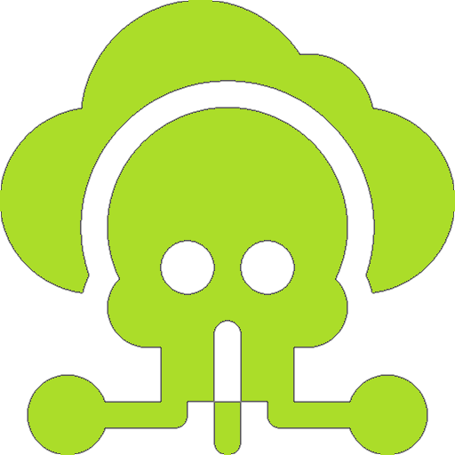
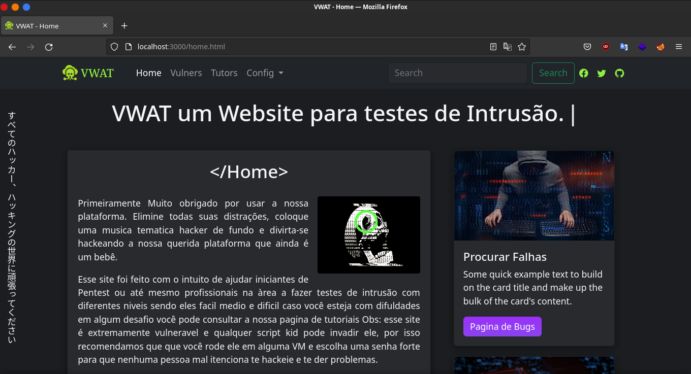

<h1 align=center>VWAT - BETA</h1>

VWAT - (Vulnerable Web Application Testing)
 

Um website extremamente vulnerável para testes de Pentest 
Web para quem estar iniciando na área de segurança da 
informação e até mesmo profissionais da área. esse site foi inspirado em Watch Dogs 2 e HTB
 

 

⚠️ ATENÇÃO recomendamos que você use esse site em uma 
máquina virtual e escolha uma senha difícil para que
 nenhuma pessoa mal intencionada invada a sua maquina. ⚠️

## Contribuidores 

| [ @N3utr0n-FHC](https://github.com/N3utr0n-FHC) |
| :---: |

